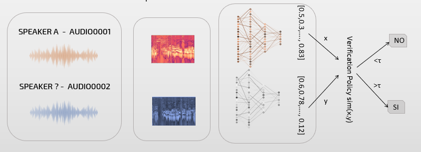

# Fair Voice Toolbox
[](https://travis-ci.org/pages-themes/cayman)
[](http://badge.fury.io/gh/boennemann%2Fbadges)
[](https://david-dm.org/boennemann/badges)
[](https://github.com/ellerbrock/open-source-badge/)



## Installation

Install Python (>=3.7):
```
$ sudo apt-get update
$ sudo apt-get install python3.7
```
Install all the requirements needed:
```
pip install -r https://github.com/mirkomarras/fair-voice/blob/master/requirements.txt
```
Clone this repository:
```
$ git clone https://github.com/mirkomarras/fair-voice.git
```

## Usage

#### Train and test your model


For the train the model:
```
python train.py --train_csv_path   "Path of the csv file that you want to use for train"
                --audio_dir        "Path of the directory that contains all the audio file"
                --net              "Network architecture "
                --n_epochs         "Number of epochs"
                --batch            "Batch size"
                --learning_rate    "Learning rate "
                --decay_factor     "Decay factor"
                --decay_step       "Decay step"
                --loss             "Loss"
                --aggregation      "Aggregation strategy"
                --vlad_cluster     "Number of Vlad Cluster"
                --ghost_clusters   "Number of Ghost Cluster"
```

For test the model:
```
python test.py  --net              "Network architecture "       
                --test_pair_path   "Path of the csv file that you want to use for test"
                --audio_dir        "Path of the directory that contains all the audio file"
                --aggregation      "Aggregation strategy"
```

## Contribution
This code is provided for educational purposes and aims to facilitate reproduction of our results, and further research
in this direction. We have done our best to document, refactor, and test the code before publication.

If you find any bugs or would like to contribute new models, training protocols, etc, please let us know.

Please feel free to file issues and pull requests on the repo and we will address them as we can.

## Citations

```
Fenu, G., Lafhouli, H. and Marras, M. (2020).
Exploring Algorithmic Fairness in Deep Speaker Verification.
```

## License
This code is free software: you can redistribute it and/or modify it under the terms of the GNU General Public License as published by the Free Software Foundation, either version 3 of the License, or (at your option) any later version.

This software is distributed in the hope that it will be useful, but without any warranty; without even the implied warranty of merchantability or fitness for a particular purpose. See the GNU General Public License for details.

You should have received a copy of the GNU General Public License along with this source code. If not, go the following link: http://www.gnu.org/licenses/.
